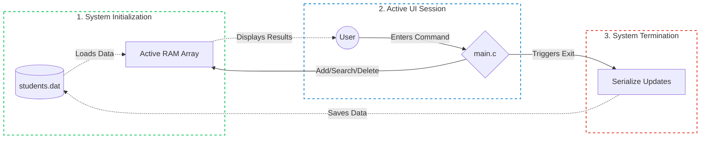

# 🎓 Student Management System


A modular, file-bound CLI tool designed to manage student academic records through active memory and persistent local storage.

---

# System Architecture

The project utilizes a multi-file structure where `main.c` acts as the central router, delegating tasks to specific modules. All modules share a common data contract provided by the `student.h` header file.

````markdown
📁 student-management-system
 │
 ├── [student.h]  <-- (Global Authority: Core Structs & Prototypes)
 │
 └── [main.c]     <-- (Master Execution Hub & Menu Router)
      ├── add.c           └── [Logic: Create Profile]
      ├── search.c        └── [Logic: Read/Query Memory]
      ├── update.c        └── [Logic: Modify Recorded Record]
      ├── display.c       └── [logic: Show All Recorded Records]
      ├── delete.c        └── [Logic: Shift Array Memory]
      └── file_handler.c  └── [Disk I/O: Load/Save Serialization]
````
      
# Data Flow & Memory Lifecycle

To ensure lightning-fast operations, the system limits disk I/O. Data is loaded into an active RAM array upon boot. All user operations manipulate this live memory, which is only serialized back to the hard drive when the application terminates.


# Core Features

Data Persistence: Automatically manages disk I/O, ensuring no data is lost between sessions.

Active RAM Operations: Performs fast CRUD (Create, Read, Update, Delete) directly in memory.

Array Shifting: Systematically purges deleted entries and shifts remaining memory to maintain continuous indexing without gaps.

Modular Design: Isolated logic prevents merge conflicts and allows for clean parallel development.

# Quick Start

Any C compiler is supported for this project. Please navigate to the `student-management-system/` directory and use the build methods we prepared that matches your environment OR you can compile the project yourself with your prefered compiler in the `src/` directory.

##  Linux / macOS

1. **Build the system:**
    ```bash
    make
    ```
2. **Run the tool:**
    ```bash
    ./sms
    ```

##  Windows

1. **Build the system:**
    ```terminal
    ./build.bat
    ```
2. **Run the tool:**
    ```terminal
    ./sms.exe
    ```
# Cache Break
